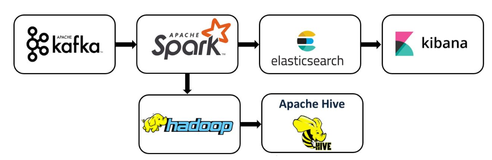
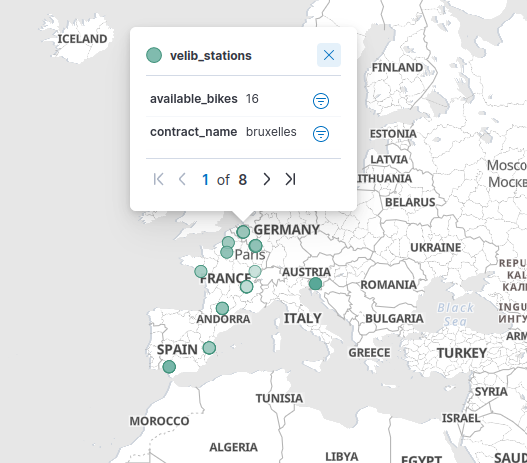
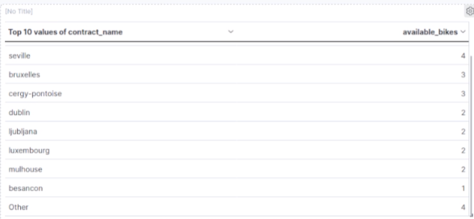
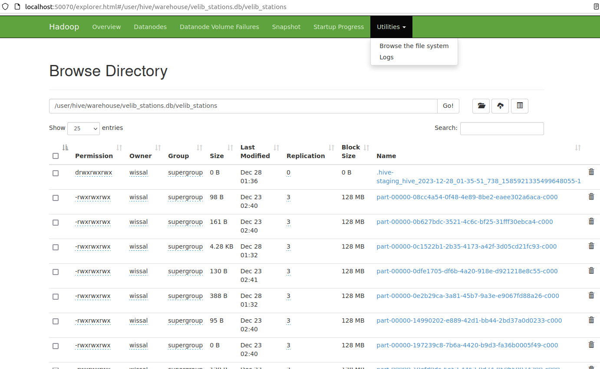
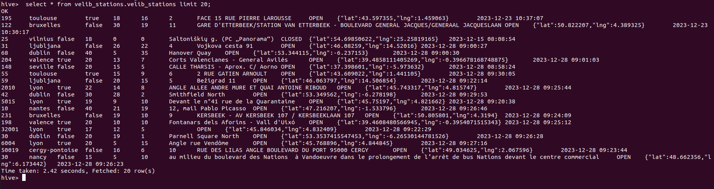

# Real-time-bike-station-status-visualization
## Context
This repository hosts a comprehensive data engineering project aimed at revolutionizing the experience of bike-sharing systems. The project focuses on real-time visualization of bike station statuses, facilitating effortless bike pick-up and drop-off for users while providing crucial insights for station managers.
## Technologies Used
- Scala: 2.12.15
- Apache Spark: 3.2.4
- Apache Kafka: 3.6.0
- Apache Hadoop: 2.10.2
- Apache Hive: 2.3.9
- Elasticsearch: 8.8.2
- Kibana: 8.8.2
##Pipeline
our project pipeline is as follows:

## Steps

1. **Data Collection - Bike Station API**
   - Collect real-time bike station information such as station location, available bikes, docked bikes, and station status.

2. **Kafka Real-Time Producer**
   - Set up a Kafka server with Zookeeper and create a Kafka topic dedicated to transporting bike station data.
   - Develop a producer script to ingest data from the bike station API and publish it to the Kafka topic.

3. **PySpark Streaming**
   - Create a Spark Streaming application that acts as a Kafka consumer, continuously fetching bike station data from the Kafka topic.
   - Process and transform this data as needed and prepare it for indexing.

4. **Index Bike Station Data to Elasticsearch**
   - Enable and start Elasticsearch to serve as the storage backend.
   - Configure your PySpark application to index the processed bike station data into Elasticsearch, ensuring real-time updates of station statuses.
   - Confirm Elasticsearch functionality by accessing http://localhost:9200.

5. **Store Data in Hive**
   - Implement integration with Apache Hive for structured querying and analysis of historical bike station data.
   - Store processed and aggregated data from Elasticsearch into Hive tables for deeper analytics and reporting capabilities.

6. **Kibana for Visualization**
   - Utilize Kibana as a visualization tool to explore and visualize the real-time bike station data stored in Elasticsearch.
   - Develop real-time dashboards and visualizations depicting bike station statuses, availability, and trends.
   - Access Kibana via http://localhost:5601 for live visualization of bike station metrics.
## How to run
Launch zookeeper and kafka servers by navigating to kafka directory then execute the following commands:
```bash
bin/zookeeper-server-start.sh config/zookeeper.properties
bin/kafka-server-start.sh config/server.properties
```
### Store Data in Elasticsearch
  - 1- Start Elasticsearch: Navigate to the Elasticsearch directory and execute the following command:
    ```bash
    ./bin/elasticsearch
    ```
  - 2- create kafka topic:
    ```bash
    kafka-topics.sh --create --bootstrap-server localhost:9092 --replication-factor 1 --partitions 1 --topic velib_stations
    ```
  - 3- Create Elasticsearch index
    ```bash
    python3 create_index.py
    ```
  - 4- Run the Kafka producer:
    ```bash
    python3 kafka_producer.py
    ```
  - 5- Run the consumer:
    ```bash
    ./execute_consumer.sh
    ```
### Store Data in a Hive Table
  - 1- Run the hadoop cluster: Navigate to the Hadoop directory and execute the following command:
    ```bash
    ./sbin/start-all.sh
    ```
  - 2- Run the Hive service metastore:
    ```bash
    hive --service metastore
    ```
  - 3- Run the consumer:
    ```bash
    ./execute_hive_store.sh
    ```
## Visualize results
kibana dashboard:
This map displays the available bikes geographically:


This table displays the number of avialble bikes in the stations:



This is the generated table on hive :



